# :taxi: Verbal Explanations of Spatio-Temporal Graph Neural Networks for Traffic Forecasting :car:

Intelligent Transportation Systems (ITS) built using Deep Neural Network (DNN) models offer an effective solution for handling short-term traffic flow, which greatly assists drivers, travellers or public security and safety in their decision-making. In particular, Spatio-Temporal Graph Neural Networks (STGNNs) have gained popularity as a powerful tool for effectively modelling spatio-temporal dependencies in diverse real-world urban applications, including intelligent transportation and public safety. However, the black-box nature of these models prevents a true understanding of the results and a trustworthy adoption by their users.

The research field of eXplainable Artificial Intelligence (XAI) addresses this concern by developing systems that help users trust non-transparent AI. Non-expert ITS users are primarily interested in the non-technical reasons behind model predictions. Hence, leveraging Natural Language Generation (NLG), verbal descriptions of the reasons behind model outcomes are a peculiar tool to provide an easy and clear illustration of the process.

This work focuses on developing an XAI system to explain short-term speed forecasts in traffic networks obtained from STGNNs. The primary emphasis lies in explaining the reasons behind predicted traffic congestions or free flows. Key information justifying these predictions is extracted from the input traffic network in the form of a significant subgraph. The information of the subgraph is finally summarized and it is then converted into text using a template-based approach.

For more detailed informations about the used functions, look into the corresponding docstrings inside the python files, inside the `src` folder.

## Description
This work aims to develop a new *XAI* system tailored for non-technical users, explaining short-term speed predictions in traffic networks generated by a *STGNN*. It focuses on clarifying the reasons behind both traffic congestion and free flow.

  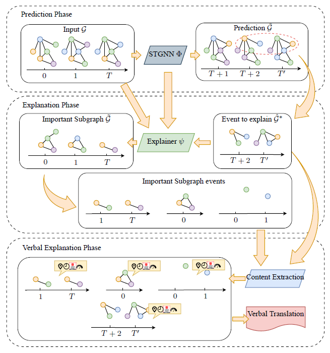

 The STGNNs used in the experiment are built following the paper [Traffic Flow Prediction via Spatial Temporal Graph Neural Network](https://dl.acm.org/doi/10.1145/3366423.3380186). Two extensive real world datasets are used for the experiment, namely *METR-LA* and *PEMS_BAY* previously used in [Diffusion Convolutional Recurrent Neural Network: Data-Driven Traffic Forecasting](https://arxiv.org/abs/1707.01926).

  | METR-LA                          | PEMS-BAY                         |
  |:---------------------------------------:|:--------------------------------------:|
  | 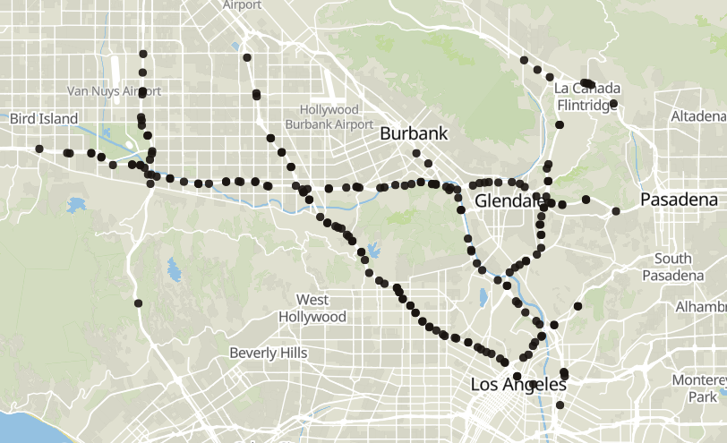  | 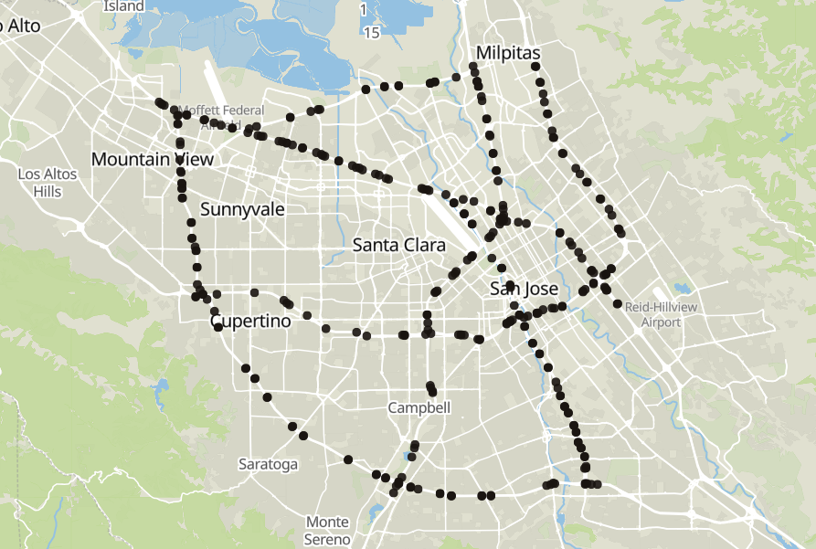 |

To achieve this goal, the system uses a transparent and easily comprehensible *post-hoc model inspection* explainer to provide explanations which can be more easily conveyed to the target users and which consider both the local and global scope of explanations. These explanations are performed on extracted events in the predicted output and they take the visual form of an *important subgraph* within the input traffic network data, highlighting information crucial for the forecasts. The global aspect of the search is obtained by cutting the input graph in a subset according to *traffic laws* measuring correlations between input and output nodes. The obtained subgraph is then furtherly pruned by a localized *Monte Carlo Tree Search (MCTS)*, obtaining a refined explanation for the output event. The obtained refined subgraph is finally divided in clusters illustrating events that led to the outcome. The explainer takes inspiration from [Explaining Temporal Graph Models through an Explorer-Navigator Framework](https://openreview.net/forum?id=BR_ZhvcYbGJ), but deeply modifies its implementation.

  | METR-LA Visual Explanation Example                         | PEMS-BAY Visual Explanation Example                       |
  |:---------------------------------------:|:--------------------------------------:|
  | Important Subgraph 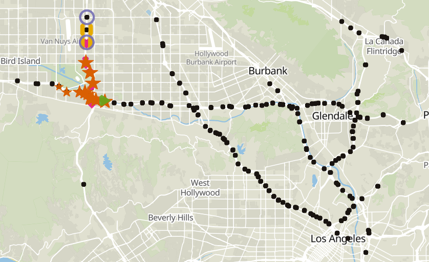  Event to Explain 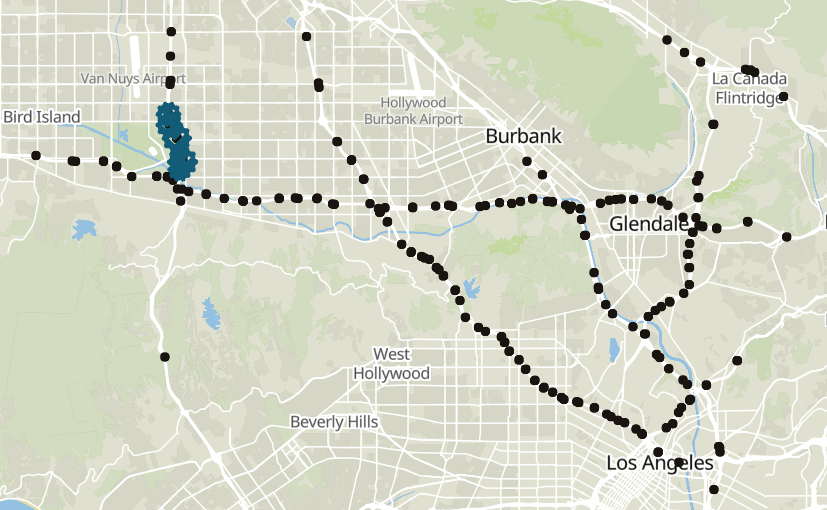 | Important Subgraph 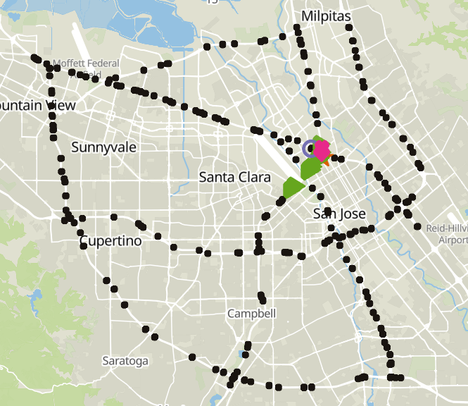 Event to Explain 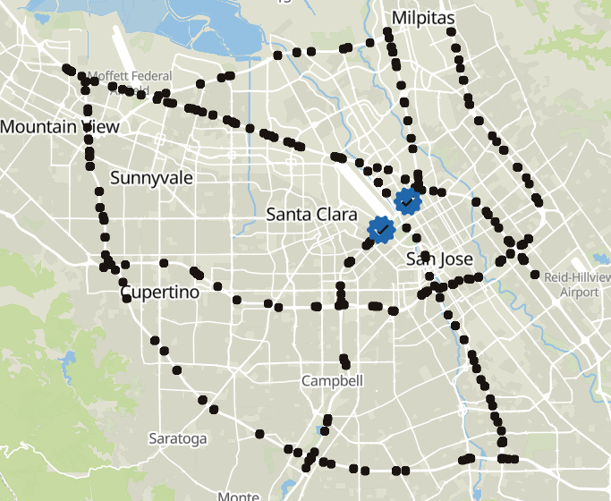 |

These visual explanations are then enriched by their translation into verbal descriptions to better align with the *social process of understanding*. The system finally summarizes essential data from the extracted subgraph into clear, straightforward text, using a simple *data-to-sequence template-based method* to ensure easy comprehension.

  | METR-LA Verbal Explanation Example |
  |:----------------------------------:|
  | Causes                             |
  | 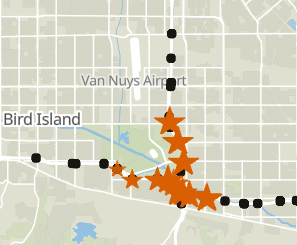 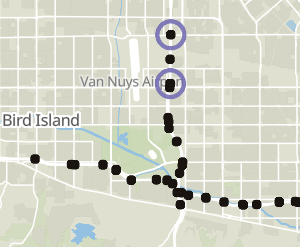 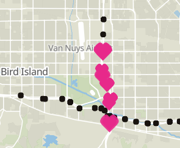 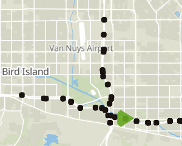 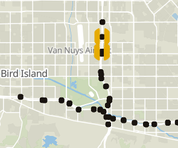  |
 Event to Explain                             |
  |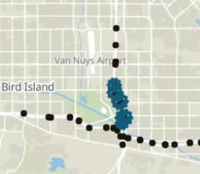 |
  | Verbal Translation |

  | |
  |:----------------------------------|
  | “San Diego Freeway at kms 11, 12, 13 and 14 was forecasted to see severe congestion on Wednesday, 04/06/2012, with an average speed of 24.04 km/h from 07:45 to 08:40. This occurred because of a series of congestions and a free flow.     To start, a contributing free flow materialized, at 107.75 km/h, on San Diego Freeway at kms 8 and 10 from 06:45 to 06:50.     Following this, contributing congestion occurred, averaging at a speed of 82.83 km/h, on, another time, San Diego Freeway at kms 9 and 10 from 06:45 to 07:10.     Afterwards, a new contributing congestion took place, with an average speed of 88.65 km/h, on Ventura Freeway at kms 27, 28, 29, 30 and 31 occurring from 06:45 to 07:40. The congestion also took place on, once again, San Diego Freeway at kms 11, 12 and 13.      After this, a contributing severe congestion happened on, yet again, San Diego Freeway at kms 10, 11, 12, 13, 14 and 15 from 06:45 to 07:40 with an average speed of 19.70 km/h.     To conclude, yet a further contributing congestion occurred at 07:30 on, again, Ventura Freeway at km 27 with an average speed of 72.62 km/h.” |

## Details

The *STGNNs* are trained on a constructed training set for both METR-LA and PEMS-BAY. Their performance during training is evaluated on extrtacted validation sets. After the training process is complete, the models are then evaluated on the test set.

The project uses the following metrics to evaluate the STGNNs performances:

* Mean Absolute Error (MAE)
* Root Mean Squared Error (RMSE)
* Mean Absolute Percentage Error (MAPE)

The test results for different time horizons are reported here.

| Dataset  | Metric | 15min | 30min | 60min  |
|----------|--------|-------|-------|--------|
| METR-LA  | MAE    | 2.92  | 3.27  | 3.86   |
|          | MAPE   | 7.8%  | 9.05% | 11.5%  |
|          | RMSE   | 5.55  | 6.4   | 7.74   |
| PEMS-BAY | MAE    | 1.18  | 1.49  | 1.92   |
|          | MAPE   | 2.43% | 3.26% | 4.54%  |
|          | RMSE   | 2.48  | 3.36  | 4.43   |

The test results for different event kinds are reported here.

| Dataset  | Metric | Severe Congestion  | Congestion | Free Flow |
|----------|--------|--------------------|------------|-----------|
| METR-LA  | MAE    | 12.2               | 5.21       | 1.96      |
|          | MAPE   | 65.1%              | 10.6%      | 3.02%     |
|          | RMSE   | 17.9               | 7.73       | 4.16      |
| PEMS-BAY | MAE    | 10.6               | 4.46       | 1.07      |
|          | MAPE   | 49.1%              | 9.23%      | 1.64%     |
|          | RMSE   | 15.8               | 7.05       | 1.95      |

The *explainer* are fine tuned by applying grid search on the input graphs of events extracted from the predictions of the training set. Subsequently, the explanations of the explainers are evaluated on selected predictions of the validation and test set.

The project uses the following metrics to evaluate the explainer performances:

* Fidelity $^-$
* Fidelity $^+$
* Sparsity
* Average Time

The test results for different event kinds are reported here.

| Dataset  | Fidelity $^-$ | Severe Congestion  | Congestion | Free Flow | Total |
|----------|---------------|--------------------|------------|-----------|-------|
| METR-LA  | MAE $^-$      | 3.21               | 1.65       | 0.713     | 1.84  |
|          | MAPE $^-$     | 14.1%              | 3.45%      | 1.09%     | 6.14% |
|          | RMSE $^-$     | 3.82               | 2.06       | 0.881     | 2.24  |
| PEMS-BAY | MAE $^-$      | 12.5               | 2.65       | 1.97      | 5.67  |
|          | MAPE $^-$     | 59.3%              | 5.24%      | 2.93%     | 22.4% |
|          | RMSE $^-$     | 12.9               | 3.13       | 2.15      | 6.02  |

| Dataset  | Fidelity $^+$ | Severe Congestion  | Congestion | Free Flow | Total |
|----------|---------------|--------------------|------------|-----------|-------|
| METR-LA  | MAE $^+$      | 19.1               | 9.68       | 2.96      | 10.6  |
|          | MAPE $^+$     | 86.2%              | 20.4%      | 4.54%     | 37.1% |
|          | RMSE $^+$     | 20.9               | 10.6       | 3.5       | 11.7  |
| PEMS-BAY | MAE $^+$      | 17.2               | 9.6        | 41.8      | 22.8  |
|          | MAPE $^+$     | 73.1%              | 19.2%      | 63.2%     | 51.8% |
|          | RMSE $^+$     | 19.1               | 10.7       | 46        | 25.3  |

| Dataset  | Sparsity |
|----------|----------|
| METR-LA  | 0.985    |
| PEMS-BAY | 0.985    |

| Dataset  | Average Explanation Time |
|----------|--------------------------|
| METR-LA  | 8.88 s                   |
| PEMS-BAY | 11.6 s                   |

## Interface

### Data Preparation
The datasets used in the experiment are available at [link](https://drive.google.com/drive/folders/10FOTa6HXPqX8Pf5WRoRwcFnW9BrNZEIX) and [link](https://github.com/liyaguang/DCRNN/tree/master/data/sensor_graph).
In particular, the user should download the following files:
* `metr-la.h5`
* `adj_mx.pkl` and rename it to `adj_mx_metr_la.pkl` 
* `distances_la_2012.csv` and rename it to `distances_metr_la.csv`
* `graph_sensor_locations.csv` and rename it to `graph_sensor_locations_metr_la.csv`

and copy them in the folder `./data/metr-la/raw`.

Furthermore, the user should download the following files:
* `pems-bay-h5`
* `adj_mx_bay.pkl` and rename it to `adj_mx_pems_bay.pkl` 
* `distances_bay_2017.csv` and rename it to `distances_pems_bay.csv`
* `graph_sensor_locations_bay.csv` and rename it to `graph_sensor_locations_pems_bay.csv`

and copy them in the folder `./data/pems-bay/raw`.

### Data Analysis
To perform the analysis of *METR-LA* run the notebook [00 Data Analysis on the Metr-LA Dataset](notebooks/00%20Data%20Analysis%20on%20the%20Metr-LA%20Dataset.ipynb).

While to analyse *PEMS-BAY* run the notebook
[00 Data Analysis on the PeMS-Bay Dataset](notebooks/00%20Data%20Analysis%20on%20the%20PeMS-Bay%20Dataset.ipynb).

### STGNNs Training and Predictions
To train the *STGNN* on METR-LA and perform its prediction on the training validation ad test sets run the notebook
[01 Building a STGNN for the Metr-LA dataset](<notebooks/01 Building a STGNN for the Metr-LA dataset.ipynb>).

To perform the same process on PEMS-BAY run [01 Building a STGNN for the PeMS-Bay dataset](notebooks/01%20Building%20a%20STGNN%20for%20the%20PeMS-Bay%20dataset.ipynb).

### Run the Explainer
To run the explainer on the predictions of METR-LA:
- Firstly, extract predicted events by running [02 Clustering the Predictions of the Metr-LA Dataset](notebooks/02%20Clustering%20the%20Predictions%20of%20the%20Metr-LA%20Dataset.ipynb).
- Then, run the explainer on the notebook [03 Monte Carlo Tree Search on the Metr-LA Dataset](notebooks/03%20Monte%20Carlo%20Tree%20Search%20on%20the%20Metr-LA%20Dataset.ipynb).
- Finally cluster the explanations into input events through [04 Clustering the Explanations of the Metr-LA Dataset](notebooks/04%20Clustering%20the%20Explanations%20of%20the%20Metr-LA%20Dataset.ipynb).

For what concerns PEMS-BAY, the same process can be obtained by running in order the following notebooks:
- [02 Clustering the Predictions of the PeMS-Bay Dataset](notebooks/02%20Clustering%20the%20Predictions%20of%20the%20PeMS-Bay%20Dataset.ipynb).
- [03 Monte Carlo Tree Search on the PeMS-Bay Dataset](notebooks/03%20Monte%20Carlo%20Tree%20Search%20on%20the%20PeMS-Bay%20Dataset.ipynb).
- [04 Clustering the Explanations of the PeMS-Bay Dataset](notebooks/04%20Clustering%20the%20Explanations%20of%20the%20PeMS-Bay%20Dataset.ipynb).

### Verbal Translation
To translate the explanations of METR-LA into text narratives run the notebook.

[06 Verbal Explanations on the Metr-LA Dataset](notebooks/06%20Verbal%20Explanations%20on%20the%20Metr-LA%20Dataset.ipynb).

To perform the same process on PEMS-BAY run [06 Verbal Explanations on the PeMS-Bay Dataset](notebooks/06%20Verbal%20Explanations%20on%20the%20PeMS-Bay%20Dataset.ipynb).

In order to visualize an explained instance of METR-LA or PEMS-BAY run [07 Visualizing an Explained Instance of the Metr-LA Dataset](notebooks/07%20Visualizing%20an%20Explained%20Instance%20of%20the%20Metr-LA%20Dataset.ipynb) or [07 Visualizing an Explained Instance of the PeMS-Bay Dataset](<notebooks/07%20Visualizing%20an%20Explained%20Instance%20of%20the%20PeMS-Bay%20Dataset.ipynb>) respectively.

Note, the street and kilometrages for the nodes used in the verbal narratives have been extracted through notebooks [05 Fetching the Nodes Locations on the Metr-LA Dataset](notebooks/05%20Fetching%20the%20Nodes%20Locations%20on%20the%20Metr-LA%20Dataset.ipynb) and [05 Fetching the Nodes Locations on the PeMS-Bay Dataset](notebooks/05%20Fetching%20the%20Nodes%20Locations%20on%20the%20PeMS-Bay%20Dataset.ipynb>) respectively. Since the node geolocation results are not deterministic, refer to [link](data/metr-la/structured/node_locations.pkl) and [link](data/pems-bay/structured/node_locations.pkl) for the extracted geolocations of the nodes used in the experiment.

## Repository structure
    .
    ├── config
    │   └── kepler                                                              # Directory containing kepler configuration files to visualize the spatio-temporal graphs.
    ├── data
    │   ├── metr-la                                                             # Directory containing the data of METR-LA used in the experiment
    │   └── pems-bay                                                            # Directory containing the data of PEMS-BAY used in the experiment                                  
    ├── images                                                                  # Directory containing images used in the notebooks and in the README.
    ├── model
    │   └── checkpoints
    │       ├── st_gnn_metr_la.pth                                              # The weights of the STGNN trained on METR-LA.
    │       └── st_gnn_pems_bay.pth                                             # The weights of the STGNN trained on PEMS-BAY.
    ├── notebooks
    │   ├── [TEST] Error of the STGNN by event kind on Metr-LA.ipynb            # Notebook to visualize the errors of the STGNN on METR-LA by event kind.
    │   ├── [TEST] Error of the STGNN by event kind on PeMS-Bay.ipynb           # Notebook to visualize the errors of the STGNN on PEMS-BAY by event kind.
    │   ├── 00 Data Analysis on the Metr-LA Dataset.ipynb                       # Notebook to perform data analysis on METR-LA.
    │   ├── 00 Data Analysis on the PeMS-Bay Dataset.ipynb                      # Notebook to perform data analysis on METR-LA.
    │   ├── 01 Building a STGNN for the Metr-LA dataset.ipynb                   # Notebook to build, train, validate the STGNN on the METR-LA dataset and perform the predictions.
    │   ├── 01 Building a STGNN for the PeMS-Bay dataset.ipynb                  # Notebook to build, train, validate the STGNN on the PEMS-BAY dataset and perform the predictions.
    │   ├── 02 Clustering the Predictions of the Metr-LA Dataset.ipynb          # Notebook to divide the predictions of METR-LA in traffic events.
    │   ├── 02 Clustering the Predictions of the PeMS-Bay Dataset.ipynb         # Notebook to divide the predictions of PEMS-BAY in traffic events.
    │   ├── 03 Monte Carlo Tree Search on the Metr-LA Dataset.ipynb             # Notebook to fine tune the explainer and obtain the explanations of the extracted events of METR-LA.
    │   ├── 03 Monte Carlo Tree Search on the PeMS-Bay Dataset.ipynb            # Notebook to fine tune the explainer and obtain the explanations of the extracted events of PEMS-BAY.
    │   ├── 04 Clustering the Explanations of the Metr-LA Dataset.ipynb         # Notebook to divide the explanations of METR-LA in traffic events.  
    │   ├── 04 Clustering the Explanations of the PeMS-Bay Dataset.ipynb        # Notebook to divide the explanations of PEMS-BAY in traffic events.
    │   ├── 05 Fetching the Nodes Locations on the Metr-LA Dataset.ipynb        # Notebook to extract the geolocations of the nodes of METR-LA.
    │   ├── 05 Fetching the Nodes Locations on the PeMS-Bay Dataset.ipynb       # Notebook to extract the geolocations of the nodes of PEMS-BAY.
    │   ├── 06 Verbal Explanations on the Metr-LA Dataset.ipynb                 # Notebook to translate verbally the explanations of METR-LA.
    │   ├── 06 Verbal Explanations on the PeMS-Bay Dataset.ipynb                # Notebook to translate verbally the explanations of PEMS-BAY.
    │   ├── 07 Visualizing an Explained Instance of the Metr-LA Dataset.ipynb   # Notebook to visualize an explanation of METR-LA.
    │   ├── 07 Visualizing an Explained Instance of the PeMS-Bay Dataset.ipynb  # Notebook to visualize an explanation of PEMS-BAY.
    ├── src
    │   ├── data
    │   │   ├── __init__.py
    │   │   ├── data_analysis.py                                                # Module providing scripts to perform data analysis.
    │   │   ├── data_extraction.py                                              # Module providing scripts to perform data extraction.
    │   │   ├── data_processing.py                                              # Module providing scripts to perform data processing.
    │   │   ├── dataloaders.py                                                  # Module providing scripts to build the dataloaders.
    │   │   └── dataset_builder.py                                              # Module providing scripts to build the datasets.
    │   ├── explanation
    │   │   ├── clustering
    │   │   │   ├── __init__.py
    │   │   │   ├── analyisis.py                                                # Module providing scripts to perform analysis of the clustering.
    │   │   │   ├── clustering_explanations.py                                  # Module providing scripts to perform clustering on the explaantions.
    │   │   │   ├── clustering.py                                               # Module providing scripts to perform clustering on the predictions.
    │   │   │   ├── evaluation.py                                               # Module providing scripts to perform evaluation on the clusters.
    │   │   │   └── metrics.py                                                  # Module providing metrics to perform evaluation on the clusters.
    │   │   ├── monte_carlo
    │   │   │   ├── __init__.py
    │   │   │   ├── explanation.py                                              # Module providing scripts to obtain the explanations.
    │   │   │   ├── monte_carlo_tree.py                                         # Module providing the implementation of the MCT.
    │   │   │   └── search.py                                                   # Module providing scripts to perform the MCTS by the explainer.
    │   │   ├── __init__.py
    │   │   └── events.py                                                       # Module providing scripts to perform events selection for the explanations.
    │   ├── spatial_temporal_gnn
    │   │   ├── __init__.py
    │   │   ├── metrics.py                                                      # Module providing metrics to evaluate the performances of the STGNN.
    │   │   ├── model.py                                                        # Module providing the implementation of the STGNN.
    │   │   ├── modules.py                                                      # Module providing the implementation of the modules of the STGNN.
    │   │   ├── prediction.py                                                   # Module providing scripts to perform predictions by the STGNN.
    │   │   └── training.py                                                     # Module providing scripts to train the STGNN.
    │   ├── utils
    │   │   ├── __init__.py
    │   │   ├── config.py                                                       # Module containing configuration scripts.
    │   │   └── seed.py                                                         # Module containing scripts to perform seeding for reproducible results.
    │   ├── verbal_explanations
    │   │   ├── __init__.py
    │   │   ├── content_extraction.py                                           # Python module containing scripts to extract content from the explanations.
    │   │   ├── templates.py                                                    # Python module containing templates for the verbal translation of the explanations.
    │   │   └── verbal_translation.py                                           # Python module containing scripts to perform the verbal translation of the explanations. 
    │   └── __init__.py
    ├── .gitignore
    ├── CITATION.cff
    ├── LICENSE
    └── README.md

## Dependencies
- [GeoPy](https://geopy.readthedocs.io/en/stable/) version 2.3.0
- [Kepler.gl](https://docs.kepler.gl/docs/keplergl-jupyter) version 0.3.2
- [Matplotlib](https://matplotlib.org/) version 3.6.2
- [NumPy](https://numpy.org/) version 1.23.5
- [Pandas](https://pandas.pydata.org/) version 1.5.3
- [Pytables](https://www.pytables.org/usersguide/installation.html) version 3.8.0
- [PyTorch](https://pytorch.org/) version 2.0.0+cu117
- [SciPy](https://scipy.org/) version 1.8.0
- [scikit-learn](https://scikit-learn.org/stable/) version 1.3.2

## Versioning

Git is used for versioning.

## License

This project is licensed under the MIT License - see the [LICENSE](LICENSE) file for details.

